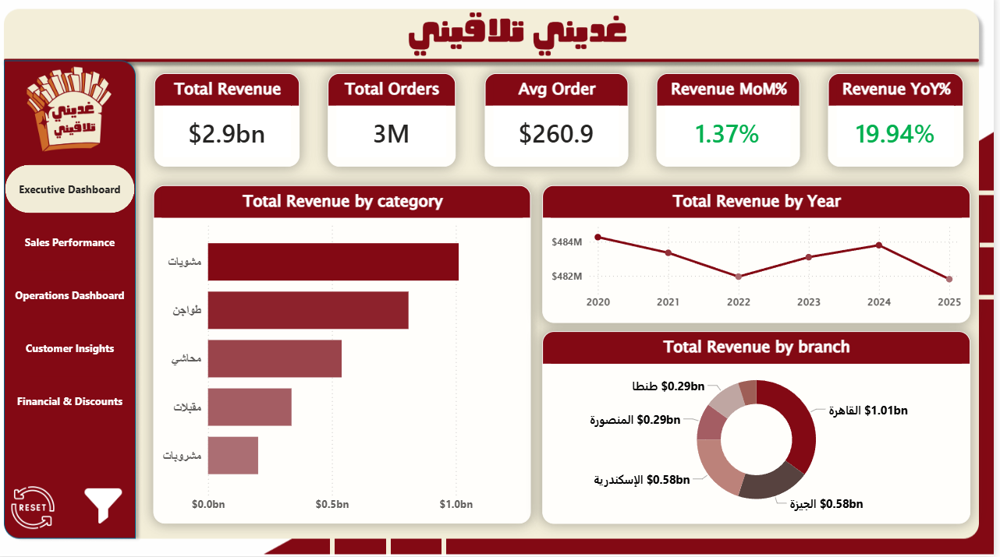
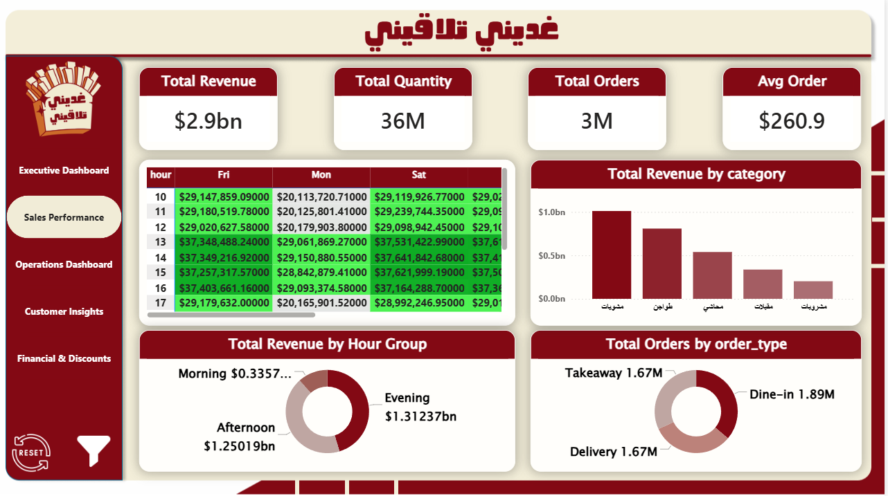
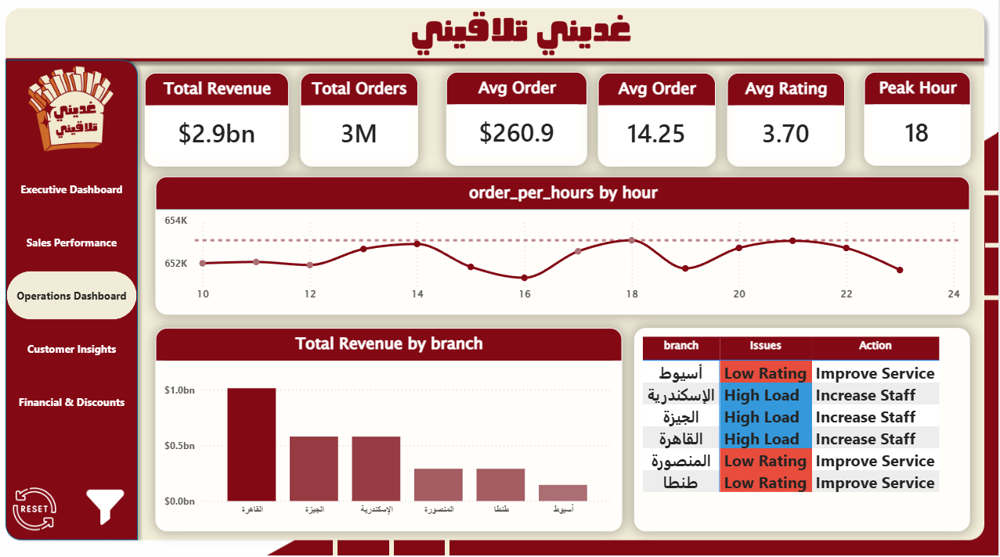
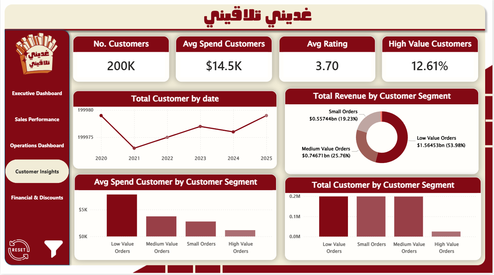
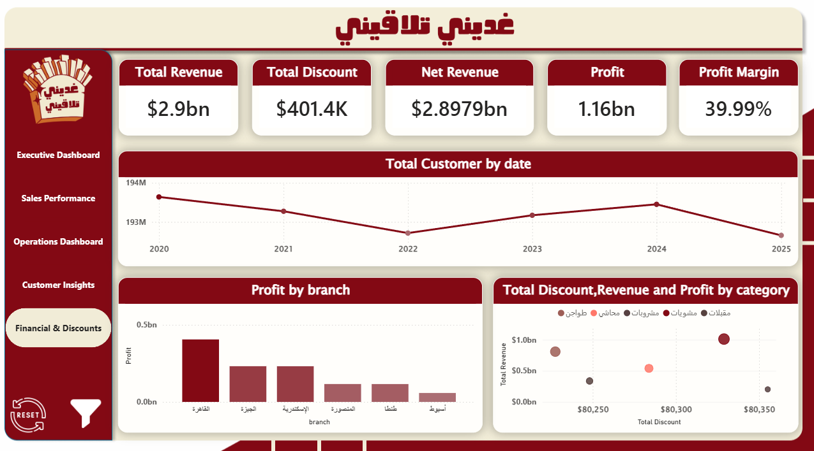
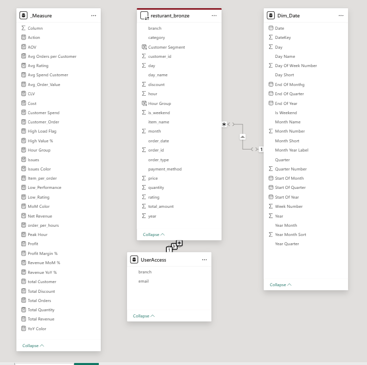

# غديني تلاقيني — Restaurant Analytics Dashboard

---

## Project Overview

**غديني تلاقيني** 

is a comprehensive multi-page Power BI business intelligence dashboard built for a restaurant chain operating across multiple Egyptian cities. The dashboard delivers end-to-end visibility into revenue, operations, customer behavior, and financial performance enabling data-driven decisions at every level of management.

The dashboard is styled with the brand's signature dark red and cream color palette and supports both Arabic and English labels throughout.

---

## 🎬 Demo

## [Resturant Dashborad.mp4](screenshot\Resturant Fast.mp4) 

## Dashboard Pages

### 1. 📊 Executive Dashboard

**Purpose:** High-level summary for leadership and C-suite stakeholders.

**KPI Cards:**
| Metric | Value |
|---|---|
| Total Revenue | $2.9bn |
| Total Orders | 3M |
| Avg Order Value | $260.9 |
| Revenue MoM% | +1.37% |
| Revenue YoY% | +19.94% |

**Visuals:**
- **Total Revenue by Category (Bar Chart):** مشويات (Grills) is the top-performing category, followed by طواجن (Tagines), محاشي (Stuffed Dishes), مقبلات (Appetizers), and مشروبات (Beverages).
- **Total Revenue by Year (Line Chart):** Trend from 2020–2025 showing revenue fluctuations around the $482M–$484M band per year.
- **Total Revenue by Branch (Donut Chart):** Cairo (القاهرة) leads with $1.01bn, followed by Giza (الجيزة) and Alexandria (الإسكندرية) each at $0.58bn, with Tanta (طنطا) and Mansoura (المنصورة) at $0.29bn each.

**Key Insights:**
- Cairo alone contributes ~35% of total revenue, making it the most critical market.
- Year-over-year growth of nearly 20% signals strong business momentum.
- Grills (مشويات) dominate the product mix — an opportunity to upsell and expand this category.

---

### 2. 📈 Sales Performance

**Purpose:** Granular analysis of sales patterns by time, category, and order type.

**KPI Cards:**
| Metric | Value |
|---|---|
| Total Revenue | $2.9bn |
| Total Quantity | 36M |
| Total Orders | 3M |
| Avg Order Value | $260.9 |

**Visuals:**
- **Revenue Heatmap Table (Hour × Day):** Displays revenue by hour (10–17) across weekdays, with peak hours at 13:00–16:00 highlighted in green, indicating the afternoon rush is the most revenue-generating window. Friday and Saturday are consistently the highest revenue days.
- **Total Revenue by Hour Group (Donut Chart):**
  - Evening: $1.31bn (largest share)
  - Afternoon: $1.25bn
  - Morning: $0.34bn
- **Total Revenue by Category (Bar Chart):** Confirms مشويات as the dominant category.
- **Total Orders by Order Type (Donut Chart):**
  - Dine-in: 1.89M
  - Takeaway: 1.67M
  - Delivery: 1.67M

**Key Insights:**
- Evening hours drive the most revenue — staffing and promotions should be prioritized for this period.
- Friday and Saturday are peak days, suggesting weekend-specific marketing campaigns would be effective.
- Dine-in remains the primary channel, but delivery and takeaway together exceed it — an important signal to invest in digital ordering infrastructure.
- Morning sessions are significantly underperforming; breakfast promotions or limited morning menus could boost utilization.

---

### 3. ⚙️ Operations Dashboard

**Purpose:** Operational health monitoring, branch load analysis, and service quality flags.

**KPI Cards:**
| Metric | Value |
|---|---|
| Total Revenue | $2.9bn |
| Total Orders | 3M |
| Avg Order Value | $260.9 |
| Avg Items/Order | 14.25 |
| Avg Rating | 3.70 |
| Peak Hour | 18:00 |

**Visuals:**
- **Orders Per Hour Line Chart:** Orders are relatively stable between 652K–654K across hours 10–24, with a notable peak at hour 18 (6 PM), confirming it as the busiest operational window.
- **Total Revenue by Branch (Bar Chart):** Cairo generates the most revenue (~$1bn), followed by Giza and Alexandria (~$0.55bn each).
- **Branch Issues & Actions Table:**

| Branch | Issue | Recommended Action |
|---|---|---|
| أسيوط (Assiut) | Low Rating | Improve Service |
| الإسكندرية (Alexandria) | High Load | Increase Staff |
| الجيزة (Giza) | High Load | Increase Staff |
| القاهرة (Cairo) | High Load | Increase Staff |
| المنصورة (Mansoura) | Low Rating | Improve Service |
| طنطا (Tanta) | Low Rating | Improve Service |

**Key Insights:**
- The average rating of 3.70/5 is below the industry benchmark — service quality improvement is a company-wide priority.
- Cairo, Alexandria, and Giza are experiencing high operational loads, signaling understaffing or capacity constraints that require immediate action.
- Assiut, Mansoura, and Tanta suffer from low ratings — likely due to service quality issues rather than volume; targeted training programs are needed.
- Peak hour at 18:00 should guide shift scheduling and kitchen prep planning.

---

### 4. 👥 Customer Insights

**Purpose:** Deep dive into customer segmentation, spending behavior, and lifetime value.

**KPI Cards:**
| Metric | Value |
|---|---|
| No. of Customers | 200K |
| Avg Spend per Customer | $14.5K |
| Avg Rating | 3.70 |
| High Value Customers | 12.61% |

**Visuals:**
- **Total Customers by Date (Line Chart):** Customer count stayed near 199,975–199,980 from 2020–2025, with a dip in 2021 and recovery through 2025, suggesting stable but slightly fluctuating customer retention.
- **Total Revenue by Customer Segment (Donut Chart):**
  - Low Value Orders: $1.56bn (53.98%) — largest segment by revenue
  - Medium Value Orders: $0.75bn (25.76%)
  - Small Orders: $0.58bn (19.23%)
  - High Value Orders: small share
- **Avg Spend by Customer Segment (Bar Chart):** Low Value Order customers have the highest average spend per customer, which may appear counterintuitive — indicating high frequency at lower per-order amounts.
- **Total Customers by Segment (Bar Chart):** Low Value Orders and Small Orders have the most customers; High Value Orders represent a small but premium segment.

**Key Insights:**
- Only 12.61% of customers are classified as high-value — a significant opportunity to develop loyalty and upsell programs to convert medium-value customers.
- Over 53% of revenue comes from low-value order customers, meaning volume drives the business more than premium spending.
- Customer count is nearly flat across 6 years — the business has not meaningfully grown its customer base, making retention and spend increase per customer the primary growth lever.
- A targeted loyalty program for medium-value customers could shift them into the high-value segment.

---

### 5 & 6. 💰 Financial & Discounts

**Purpose:** Profitability analysis, discount impact, and net revenue breakdown.

**KPI Cards:**
| Metric | Value |
|---|---|
| Total Revenue | $2.9bn |
| Total Discount | $401.4K |
| Net Revenue | $2.8979bn |
| Profit | $1.16bn |
| Profit Margin | 39.99% |

**Visuals:**
- **Total Customers by Date (Line Chart):** Quantity sold fluctuated between ~193M–194M over 2020–2025, with a dip in 2022 and recovery in 2024.
- **Profit by Branch (Bar Chart):** Cairo is the most profitable branch (~$0.45bn), followed by Giza and Alexandria (~$0.25bn each). Assiut is the least profitable.
- **Total Discount, Revenue and Profit by Category (Bubble/Scatter Chart):** Plots each food category (مشويات، طواجن، محاشي، مشروبات، مقبلات) across total discount (x-axis) vs. total revenue (y-axis), with bubble size representing profit. مشويات leads on both revenue and profit.

**Key Insights:**
- Profit margin of ~40% is strong and healthy for the restaurant industry.
- Total discounts of only $401.4K on $2.9bn revenue means discounts are barely impacting bottom line — the business has room to run strategic promotional campaigns without significant margin risk.
- Cairo is not just the top revenue branch — it also generates the most absolute profit, making it the single most important branch to protect and grow.
- مشروبات (Beverages) appear in a low-revenue, low-discount zone — potentially underpriced or undermarketed relative to other categories.
- The 2022 dip in quantity sold is worth investigating — it may correlate with external market conditions or internal operational changes.

---

## 🗄️ Data Model

**Purpose:** This section outlines the underlying data architecture and relational schema that powers the entire analytics dashboard.

**Database Structure:**
The data model is built on a star schema optimized for business intelligence queries and aggregations. It includes:

- **Fact Tables:** 
  - `Orders`  Central fact table containing transaction-level data (Order ID, Branch, Date, Customer, Amount, Discount, Quantity, Category, Order Type)
  
- **Dimension Tables:**
  - `Branches`  Branch information with location and region data
  - `Customers`  Customer profiles and segmentation data
  - `Products/Categories`  Food categories (مشويات, طواجن, محاشي, مقبلات, مشروبات)
  - `Time/Date`  Date dimensions including hour, day, month, year for granular time-based analysis
  - `Order Types`  Classification (Dine-in, Takeaway, Delivery)
  - `Users`  System user accounts and personnel information
  
- **Access Control Table:**
  - `User Access`  Tracks dashboard and report access permissions by user role

| User Role | Dashboard Access | Permissions |
|---|---|---|
| Executive | All Dashboards | Full Read Access, Strategic Planning |
| Branch Manager | Branch-Specific + Operations | Branch Data Only, Performance Tracking 

**Key Features:**
- **Optimized for Aggregations:** The schema supports rapid computation of KPIs across multiple dimensions (branch, category, time period, customer segment).
- **Scalability:** Designed to handle millions of orders across multiple years without performance degradation.
- **Referential Integrity:** Foreign key relationships ensure data consistency and enable drill-down capabilities across all dashboards.
- **Time Intelligence:** Built-in date hierarchy enables year-over-year, month-over-month, and hour-level comparisons.

**Connection Flow:**
Raw operational data → ETL Pipeline → Normalized Data Warehouse → Power BI Data Model → Interactive Dashboards

---

## Summary of Key Business Insights

| Area | Key Finding |
|---|---|
| Revenue | $2.9bn total with 19.94% YoY growth — strong growth trajectory |
| Top Branch | Cairo accounts for ~35% of total revenue |
| Top Category | Grills (مشويات) dominate sales across all branches |
| Operations | Peak hour is 18:00; Cairo, Giza, Alexandria are understaffed |
| Customer Base | 200K customers, flat growth — retention is the priority |
| Service Quality | Avg rating 3.70 — below benchmark, especially in Assiut, Mansoura, Tanta |
| Profitability | ~40% profit margin; $1.16bn profit on $2.9bn revenue |
| Discounts | Only $401.4K in discounts — very minimal discount exposure |
| Order Mix | Evening > Afternoon > Morning; Dine-in leads but digital channels are close |
| Segmentation | 53.98% of revenue from low-value customers; only 12.61% high-value |

